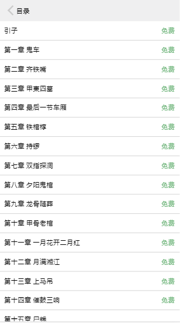

书城项目
>项目介绍

    读书在小米创作无极限 —— 这个口号一直是起点众多玄幻、魔幻、武侠、军文小说作者的创作目标，严谨的写作态度，锲而不舍的求新求变，与书友的直接沟通交流修改，从而小米有国内很多具有一流水平的原创作品，使书友得以在第一时间阅读到作者连载的好书佳作。

---
>技术栈
```
    gulp + require + handlebars + ES6 + ajax + 懒加载 + jsonp + flex + nodeJs
```
---
>项目运行
```
    git clone git@github.com:wangyixiong/citybook.git
    cnpm i install --save-dev
    cnpm run build
```
---
>目录结构
```
    bookcity
        |——mock
        |    |——data
        |         |---data.json                      //用户数据
        |         |---home.json                     //首页数据
        |         |---recommend1.json               //加载更多
        |         |---recommend2.json               //加载更多
        |         |---recommend3.json               //加载更多
        |    |——new
        |         |---352876.json                   //老九门数据
        |         |---chapter-list.json             //目录
        |         |---data1.json                    //第一章数据
        |         |---data2.json                    //第二章数据
        |         |---data3.json                    //第三章数据
        |         |---data4.json                    //第四章数据
        |    |——search
        |         |---search.json                   //搜索结果
        |         |---searchKey.json                //搜索关键字
        |    |——data.js                             //数据接口
        |——build
        |    |——index.html                          //首页
        |    |——css
        |        |---common.css                     //公共样式
        |        |---login.css                      //登陆样式
        |        |---menu.css                       //目录样式
        |        |---pageinfo.css                   //详情页样式
        |        |---search.css                     //搜索页样式
        |        |---style.css                      //首页样式
        |        |---swiper.css
        |        |---word.css                       //阅读页样式
        |    |——js
        |        |——lib
        |            |---bscroll.min.js
        |            |---flexible.js
        |            |---handlebars-v4.0.11.js
        |            |---jquery.base64.js
        |            |---jquery.lazyload.js
        |            |---jquery.min.js
        |            |---require.js
        |            |---require.text.js
        |            |---swiper.js
        |        |——page
        |            |---index.js                   //首页
        |            |---login.js                   //登录
        |            |---menu.js                    //目录
        |            |---pageinfo.js                //详情
        |            |---search.js                  //搜索
        |            |---word.js                    //阅读
        |        |——config.js                       //配置
        |    |——myself
        |          |---login.html                   //登录页面
        |          |---menu.html                    //目录页面
        |          |---pageinfo.html                //详情页面
        |          |---search.html                  //搜索页面
        |          |---word.html                    //阅读页面
        |    |——template                            //模板
        |           |---banner.html                 //轮播图大概模板
        |           |---content.html                //本周最火
        |           |---dl-list.html                //男生最爱
        |           |---expret.html                 //重磅推荐
        |           |---his.html
        |           |---menutemp.html               //目录
        |           |---page.html                   //详情
        |           |---searchinfo.html             //搜索
        |           |---searchinit.html             //搜索
        |   |---index.html                          //首页
        |——gulpfile.js                              

```
---
>部分截图





---
